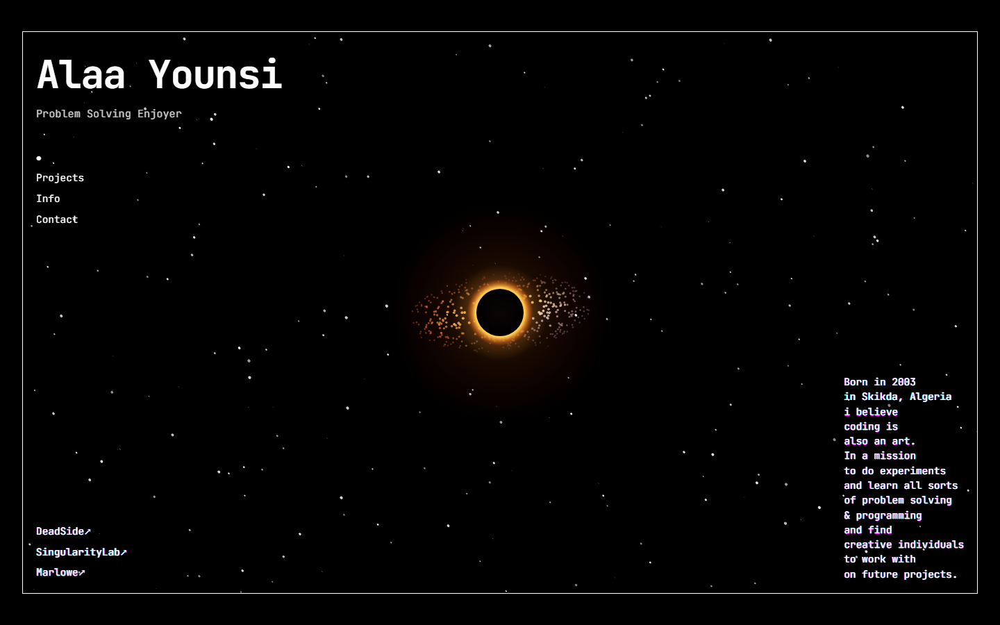
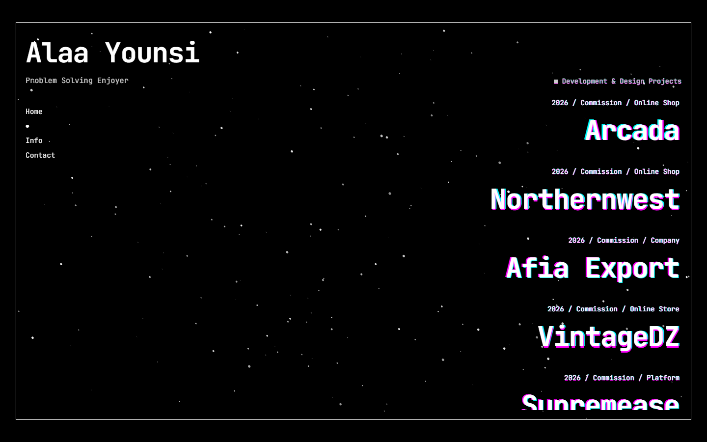
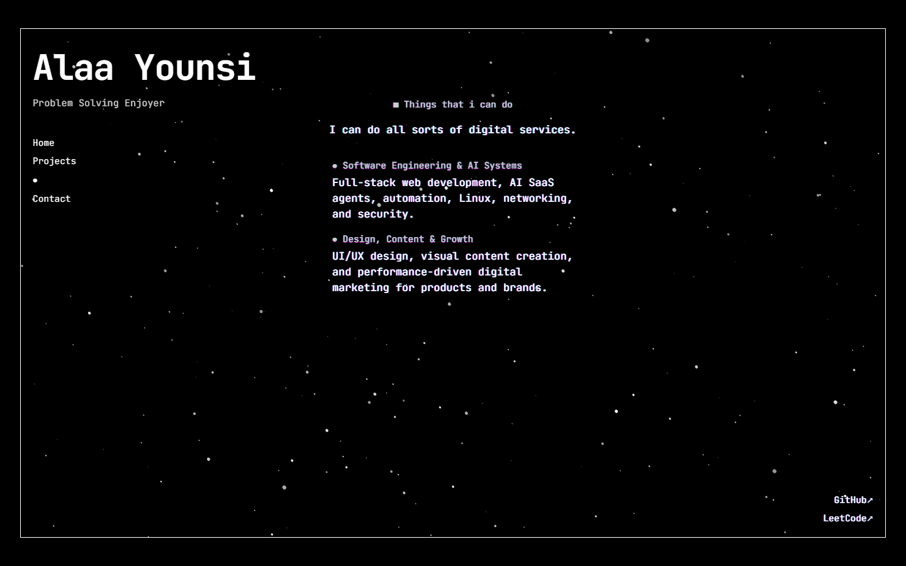
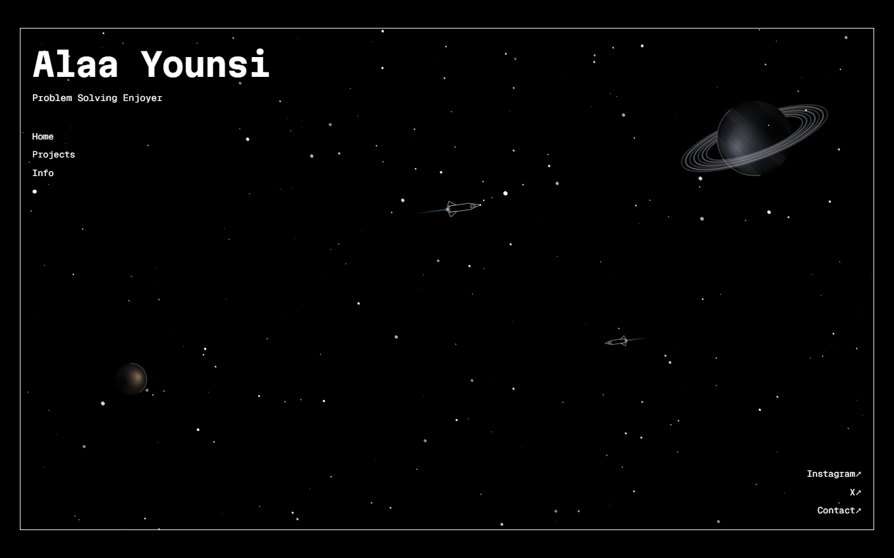
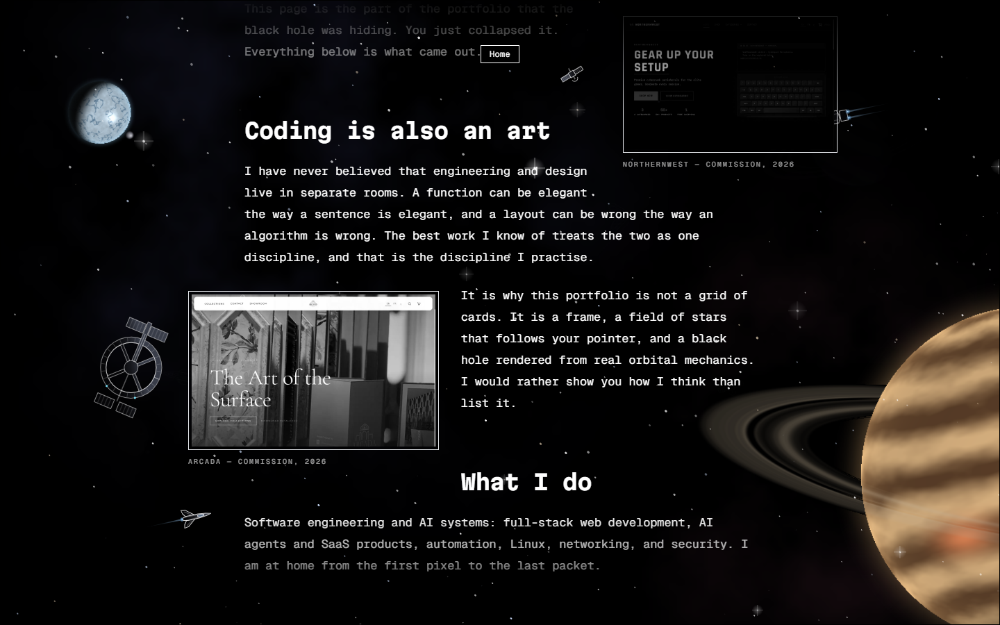
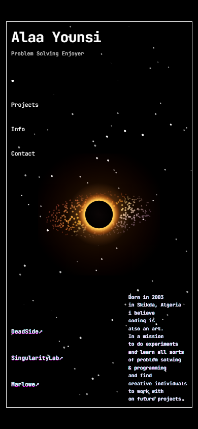
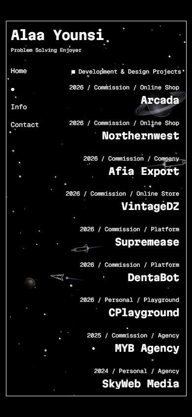
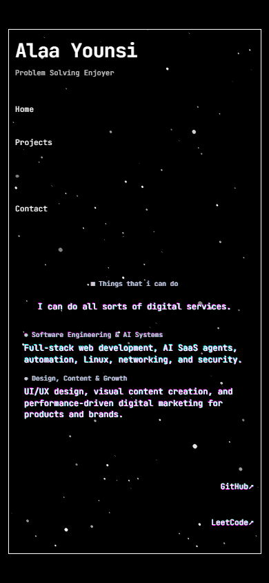

<div align="center">

# Alaa Younsi — Portfolio

**A framed interstellar single-page portfolio.**
Hand-written canvas physics, no UI kit, no animation library, three runtime dependencies.

**[ashv3il.me](https://ashv3il.me)**

[](https://github.com/Alaa-Younsi/Portfolio/actions/workflows/ci.yml)




</div>

---

## Contents

- [The idea](#the-idea)
- [Stack](#stack)
- [Quick start](#quick-start)
- [Architecture](#architecture)
- [How it works](#how-it-works)
- [Engineering standards](#engineering-standards)
- [Project layout](#project-layout)
- [Deployment](#deployment)
- [Browser support](#browser-support)
- [Screens](#screens)
- [License](#license)

---

## The idea

Most portfolios are a card grid on a white background. This one treats the
portfolio itself as the project.

Everything the site contains — the type, the navigation, and the interactive
star field behind it — lives inside a single white frame drawn over black. At
the centre sits a black hole rendered from actual orbital mechanics. Click it
and the disk detonates, the frame drops away, and the stars flood the viewport.

The design is deliberately narrow: white on black, one monospace typeface,
`clamp()`-driven fluid type, and chromatic-aberration glitch on every heading
and link. Nothing is decorative by accident.

---

## Stack

| Layer | Choice | Why |
|---|---|---|
| Runtime & packages | **Bun 1.3** | One binary for install, scripts and tests |
| Build | **Vite 8** (Rolldown) | Sub-second cold start, Rust-speed production builds |
| UI | **React 19** | Function components and hooks only |
| Language | **TypeScript 5.9** — `strict` | Plus `noUncheckedIndexedAccess` and `exactOptionalPropertyTypes` |
| Styling | **Tailwind CSS 3** | Utilities layered over CSS-variable design tokens |
| Lint & format | **Biome 2** | One binary, one config; replaces ESLint + Prettier |
| Tests | **Vitest 5** + Testing Library | jsdom, canvas stubbed |
| Hosting | **Vercel** | Static edge delivery; headers declared in `vercel.json` |

**Runtime dependencies: `react`, `react-dom`, `react-error-boundary`.** Nothing
else ships to the browser — every animation, particle system and transition in
this repository is written by hand.

---

## Quick start

> Requires [Bun](https://bun.sh) 1.1 or newer. This project does not use npm,
> pnpm or yarn; `bun.lock` is the only lockfile.

```bash
bun install      # install dependencies
bun dev          # http://localhost:5173
bun run verify   # typecheck + lint + test — exactly what CI runs
bun run build    # typecheck, then production build into dist/
bun run preview  # serve the production build locally
```

| Script | Does |
|---|---|
| `dev` | Vite dev server with HMR |
| `build` | `tsc --build` then `vite build` |
| `preview` | Serves `dist/` |
| `typecheck` | Full TypeScript project build, no emit |
| `lint` | `biome check .` — lint, format and import order |
| `lint:fix` | Applies every safe fix |
| `format` | Formats only |
| `test` / `test:watch` | Vitest |
| `verify` | The complete CI gate, locally |

---

## Architecture

One architectural rule governs this codebase:

> **Anything that runs at 60 fps lives outside React.**

```
                    ┌──────────────────────────────────────┐
                    │  Home.tsx — layout + collapse state   │
                    │  idle → collapsing → collapsed →      │
                    │  restoring → idle                     │
                    └───────────────┬──────────────────────┘
                                    │  props (booleans only)
             ┌──────────────────────┼──────────────────────┐
             ▼                      ▼                      ▼
    ┌─────────────────┐   ┌──────────────────┐   ┌──────────────────┐
    │ Header / Hero / │   │  StarField.tsx   │   │  BlackHole.tsx   │
    │ About /Projects │   │  (thin wrapper)  │   │  (thin wrapper)  │
    │ / Contact       │   └────────┬─────────┘   └────────┬─────────┘
    └────────┬────────┘            │ imperative handle    │
             │                     ▼                      ▼
             │            ┌──────────────────┐   ┌──────────────────┐
             │            │ lib/starfield.ts │   │ lib/blackhole.ts │
             │            │ owns canvas,     │   │ owns canvas,     │
             │            │ listeners, rAF   │   │ listeners, rAF   │
             │            └──────────────────┘   └──────────────────┘
             ▼
    ┌─────────────────────────┐        ┌──────────────────────────┐
    │ useTypingSequence       │◄───────│ config/site.ts, data/*   │
    │ TypedText / TypedLink   │        │ (all copy and URLs)      │
    └─────────────────────────┘        └──────────────────────────┘
```

The React components in the middle column render once per navigation. The
simulations in `src/lib/` each own a canvas, their own DOM listeners and their
own `requestAnimationFrame` loop, and expose a small imperative handle
(`setHovered`, `setExploding`, `setReducedMotion`, `destroy`). React state never
changes on an animation frame.

Content is data. Copy, project entries, social links and section metadata live
in `src/config/` and `src/data/`, so editing the site is editing a typed array,
not hunting through JSX.

---

## How it works

### Star field — `src/lib/starfield.ts`

A particle system driven by pointer velocity. Each frame, pointer delta is
integrated into a velocity vector, damped by friction, and applied to every star
scaled by its depth (`z`), which produces parallax for free. Stars that cross
the frame boundary are recycled in from the opposite edge, weighted by the
direction of travel, so the field never thins out.

The frame edge is enforced twice on purpose: a 2D clip path bounds the pixels,
and a CSS `clip-path` bounds the element, because on mobile the canvas is
promoted to its own GPU layer and the compositor will otherwise paint past the
border.

### Black hole — `src/lib/blackhole.ts`

400 particles orbit on Keplerian paths, so angular velocity falls off as
`1/√r` and the inner disk visibly outruns the outer. Colour comes from a
Doppler shift: material rotating towards the viewer is blue-shifted and
brighter, material rotating away is red-shifted. Particles are depth-sorted so
the far half of the disk is occluded by the event horizon, which is layered
under a photon ring and a gravitational-lensing halo.

Clicking it seeds 200 plasma particles, expands a shockwave gradient, and hands
control to the collapse state machine in `Home.tsx`, which fades the UI, drops
the frame and releases the star field to full viewport.

### Typing engine — `src/hooks/useTypingSequence.ts`

State is a single `{ line, chars }` cursor rather than an array of partial
strings, so revealing one character costs one integer increment instead of an
array copy. Every typed line renders the finished sentence into an `.sr-only`
span alongside the animated text, so assistive technology reads whole sentences
instead of a stream of fragments, and `aria-labelledby` still resolves.

---

## Engineering standards

### Performance

| Asset | Gzipped |
|---|---|
| `index.html` | 1.7 kB |
| CSS | 4.0 kB |
| Application JS | 8.0 kB |
| React (separate chunk) | 68.2 kB |
| JetBrains Mono (variable, latin) | 40 kB |

- **Zero third-party requests.** The typeface is self-hosted as one variable
  `woff2` and preloaded from the document head — no external DNS lookup, TLS
  handshake or stylesheet round-trip on the critical path.
- Both canvases suspend their animation frame on `visibilitychange`; a
  backgrounded tab does no work.
- Device pixel ratio is capped at 2 — beyond that the additional fill rate is
  imperceptible and expensive on phones.
- Radial gradients are built once and rebuilt only when hover state changes; the
  accretion disk is depth-sorted every tenth frame rather than every frame.
- Resize handling is coalesced into a single animation frame.
- React is code-split into its own chunk, so shipping application changes does
  not invalidate it in visitors' caches.
- The production document contains **no inline script**, which is what allows
  the Content-Security-Policy to stay strict.

### Accessibility

- Semantic landmarks, a single `<h1>`, and `aria-labelledby` on every section.
- Complete sentences exposed to screen readers throughout the typing animations.
- Every external link carries a descriptive accessible name and
  `rel="noopener noreferrer"`.
- The black hole is a real `<button>` — focusable, keyboard-operable, named.
- Visible `:focus-visible` ring; decorative canvases are not focusable.
- 44 px minimum touch targets below the `sm` breakpoint.
- `prefers-reduced-motion` is honoured end to end: typing resolves instantly,
  the splash screen is skipped, the glitch stops, and both canvases render one
  static frame.

### Security

Enforced at the edge through `vercel.json`:

- **CSP**: `script-src 'self'` — no `unsafe-inline`, no `unsafe-eval` — plus
  `object-src 'none'`, `frame-ancestors 'none'`, `form-action 'none'`,
  `base-uri 'self'` and `upgrade-insecure-requests`.
- HSTS with `preload`, `X-Content-Type-Options`, `X-Frame-Options: DENY`,
  `Referrer-Policy`, `Cross-Origin-Opener-Policy`,
  `Cross-Origin-Resource-Policy`, and a deny-by-default `Permissions-Policy`.
- Immutable caching for content-hashed assets and fonts; HTML always
  revalidates.
- No `dangerouslySetInnerHTML`, no input fields, no runtime network calls, and a
  three-package runtime dependency surface kept current by Dependabot.

### SEO

Search and social crawlers do not execute JavaScript, so **every
crawler-visible tag is static in `index.html`** — title, description, canonical,
Open Graph, Twitter card, and a `Person` + `WebSite` JSON-LD graph. A
`<noscript>` block carries the real contact links. `robots.txt` and
`sitemap.xml` are generated at build time from the canonical origin, so they can
never drift out of sync with it.

The 1200×630 social card in `public/og-image.png` is generated from the same
particle mathematics the site runs, so the preview matches the product.

---

## Project layout

```
.
├── index.html                  # Static head: meta, Open Graph, JSON-LD, noscript
├── vite.config.ts              # Canonical origin, SEO generation, build, Vitest
├── tailwind.config.ts          # Design tokens: breakpoints, colours, keyframes
├── biome.json                  # Lint + format + import order
├── vercel.json                 # Security headers and cache policy
├── .github/workflows/ci.yml    # typecheck → lint → test → build
├── public/
│   ├── fonts/                  # Self-hosted JetBrains Mono (variable, latin)
│   ├── og-image.png            # Generated 1200×630 social card
│   ├── favicon.ico, icon-*.png, apple-touch-icon.png
│   └── site.webmanifest, humans.txt
└── src/
    ├── main.tsx                # Root render + error boundary
    ├── index.css               # @font-face, design tokens, base layer, glitch
    ├── config/site.ts          # Identity, socials, section metadata
    ├── data/                   # Projects and copy
    ├── lib/
    │   ├── starfield.ts        # Pointer-reactive star simulation
    │   └── blackhole.ts        # Accretion disk, photon ring, collapse
    ├── hooks/
    │   ├── useTypingSequence.ts
    │   ├── useMediaQuery.ts    # + usePrefersReducedMotion, useIsCompact
    │   └── useDocumentTitle.ts
    ├── components/             # Header, Hero, About, Projects, Contact, Frame,
    │                           # SplashScreen, StarField, BlackHole, TypedText
    └── pages/Home.tsx          # Layout + collapse state machine
```

---

## Deployment

Vercel builds the repository with `bun install --frozen-lockfile` and
`bun run build`, both declared in `vercel.json`. If the Vercel dashboard has an
install command configured, that value overrides the file — leave it empty.

### The canonical origin

The domain is written down exactly once, as `SITE_URL` at the top of
`vite.config.ts`:

```ts
const SITE_URL = "https://ashv3il.me";
```

From there it reaches:

| Destination | Mechanism |
|---|---|
| `index.html` head tags and JSON-LD | `%SITE_URL%` placeholders, replaced at transform time |
| Application code (`site.url`) | `__SITE_URL__` compile-time constant |
| `robots.txt`, `sitemap.xml` | Generated into `dist/` on every build |

Moving the site to another domain is a one-line change, and nothing can fall out
of sync.

### Pointing `ashv3il.me` at this project

1. Add `ashv3il.me` and `www.ashv3il.me` under **Project → Settings → Domains**.
2. Set the apex as primary and let Vercel redirect `www` to it, so there is one
   canonical host.
3. Apply the DNS records Vercel prints at the registrar and wait for the
   certificate to issue.

> **Note:** `SITE_URL` already points at `ashv3il.me`, ahead of the domain going
> live. Until DNS resolves, the canonical tag, Open Graph URLs and sitemap refer
> to a host that does not answer yet, which will keep the `.vercel.app`
> deployment out of search results. If the site needs to be indexed before the
> domain is connected, set `SITE_URL` back to the `.vercel.app` origin and
> redeploy.

---

## Browser support

Targets evergreen browsers — **Chrome/Edge 111+, Safari 16.4+, Firefox 113+**.
The build emits ES2022 with no legacy transpilation, and the layout depends on
`dvh` units, `clip-path` and variable fonts.

---

## Screens

| | |
|---|---|
|  |  |
|  |  |

<div align="center">
  
  
  
</div>

---

## License

**All rights reserved.** See [LICENSE](./LICENSE).

This repository is public so the work can be read and assessed. It is not a
template: reusing the design, the canvas simulations or the components to build
another site is not permitted. Quoting excerpts for review, teaching or
discussion is welcome, with credit.

The JetBrains Mono typeface in `public/fonts/` is licensed separately under the
SIL Open Font License 1.1.

---

<div align="center">

**Alaa Younsi** — Full-Stack Developer & UI/UX Designer · Skikda, Algeria

[Website](https://ashv3il.me) · [GitHub](https://github.com/Alaa-Younsi) ·
[LeetCode](https://leetcode.com/u/alaa-younsi/) · [X](https://x.com/ashv3il) ·
[Contact](https://linktr.ee/ashv3il)

</div>
